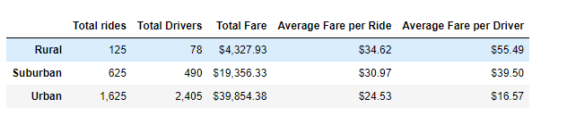
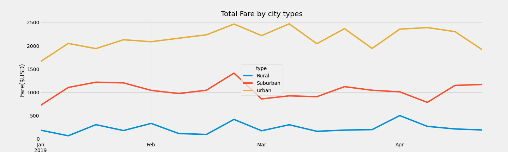

# PyBer_Analysis

## Overview
Using Python skills and knowledge of Pandas, create a summary DataFrame of the ride-sharing data by city type and with MatPlotLib create multiple-line graph that shows the total weekly fares for each city type. 

## Purpose
Analyze the given datasets, ride_data("location", "date" and "fare" for each ride) and city_data ("city","drivers","city type") and find out how the data differs by "city type" and how those differences can be used by decision-makers at PyBer.

## Resources
  - Jupyter Notebook
  - Python 3.7.6
  - Dependencies
      - Python Pandas library
      - Python Numpy library
      - Python MatPlotLib library

## Requiements

1. Create a summary DataFrame of the ride-sharing data by city type. 
2. Using Pandas and Matplotlib, create a multiple-line graph that shows the total weekly fares for each city type.
3. Report that summarizes how the data differs by city type and how those differences can be used by decision-makers at PyBer.

## Results

As per the analysis,
- It shows that Urban area have higher number of rides but Average Fare per ride is less than Rural area. ($24.53 vs $34.62)
- In Urban cities, the total fares are higher than Rural and Suburban cities. ($39,854.38 vs $4,327.93) ,($39,854.38 vs 19,356.33)
- In Urban cities the Average Fare per driver is less as compared to Rural cities. ($16.57 vs $55.49)

  

    

  
  
  
In Multiple line chart,
 - We can get information on weekly basis of "Total fare by city type" within the given timeframe that is January 2019 to April 2019.
 - It shows ride-sharing company has more total fares and profits in urban cities than in suburban and rural cities.
 - In below chart it shows urban cities has reached its  total fare to $ 2500 in the month of Feb itself but for rural area maximum total fare reached to $500 in month of April. 

    
  

## Summary

- The urban city rides make more revenue than the rural area but rural city rides are more profitable than the urban area.
  - So, it would be great to focus on improvising the plan to make urban cities rides more profitable.
- Also, it would be great to focus on drivers count, though urban cities have less rides than the drivers count. 
- Increase the per mile charges in urban cities because there are more short trips and Average fare per driver is less.
- To increase the drivers count , they can charge more to drivers who is consistence in their work. 

 
